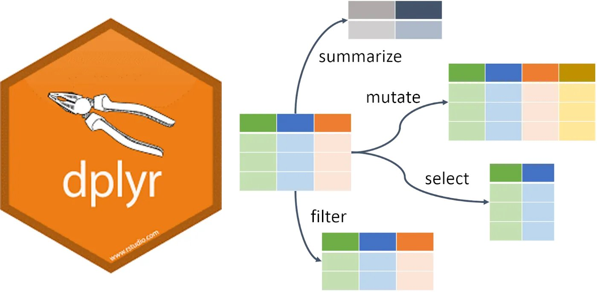

# Part 2 - Analyzing Data

---

## Intended Learning Outcomes {#ilo-part2}

* Be introduced to key `dplyr` functions for data wrangling (part of the `tidyverse`)
* Be able to create numerical summaries of data
* Be able to create graphical summaries of data
* Be able to create objects by writing and running code in the console


<!-- You can use this counter to see how many of the quiz questions you've got right: `r total_correct(elem = "h3", args = "style='color:#003366;'")` -->

## Dealing with Data: Great British Bake Off (GBBO)

```{r GBBO, echo = FALSE, out.width = "50%", fig.cap = "", warning=FALSE, message=FALSE}
knitr::include_graphics("images/GBBO_1.png")
#

ratings <- read.csv('ratings_seasons.csv')
```

The data set we will be looking at in this section refers to TV competition ["Great British Bake Off"](https://en.wikipedia.org/wiki/The_Great_British_Bake_Off) (often abbreviated to "Bake Off" or "GBBO").  Within each series, a group of amateur bakers compete against each other in a series of episodes, attempting to impress a group of judges with their baking skills. One contestant is eliminated in each episode, and the winner is selected from the contestants who reach the final. The first episode was aired on 17 August 2010, with its first four series broadcast on BBC Two, after which it moved to BBC One for the next three series. After its seventh series, it moved to Channel 4.

### Reading data in

The text file `ratings_seasons.csv` contains data on the first 10 series (2010-2019) of GBBO.   The file is on the Moodle page after the link to this lab.  When you click on it, it will download automatically to a local folder, probably the `Downloads` folder.  Find where it is saved (e.g. use the `Show in folder` option when you click on the options next to the filename at the bottom of your browser) and move it to the **same folder** as you saved the script file `S1Y_Lab_1.R` at the start of the lab.  

You will need to tell RStudio where (in what directory on your computer) to find the data set. To do this select

`> Session > Set Working Directory > Choose Directory…`

and specify the location where you've saved the data file.

`r hide("Optional: other ways of locating data")`

If you are working in a script file that is saved in the same folder as your data file(s) you can tell RStudio to find the data set in the same directory by selecting

`> Session > Set Working Directory > To source file location`
`r unhide()`

Then open/go to the `S1Y_Lab_1.R` script file in RStudio and paste and run this code to read the data in the file `ratings_seasons.csv` into the object `ratings` in RStudio.

```{r data, eval = FALSE, warning=FALSE, message=FALSE}
ratings <- read.csv('ratings_seasons.csv')
```


### Looking at data

Now that you've loaded some data, look the upper right hand window of RStudio, under the `Environment` tab. You will see the object `ratings` listed, along with the number of observations (rows) and variables (columns). This is your first check that you've read in the data correctly.

Always look at your data once you've created or loaded it. Also look at it after each step that transforms your data. There are two main ways to look at your data: `View()` and `str()`.

**`View()`**

An intuitive way to look at the data is by using `View()` (uppercase 'V'), which opens up a data table in the console pane using a viewer that looks a bit like an Excel spreadsheet. This command can be useful in the console, but don't ever put this one in a script because it will create an annoying pop-up window when the user runs it. You can also click on an object in the `Environment` pane to open it in the same interface. You can close the tab when you're done looking at it; it won't remove the object containing the data.

```{r View, eval = FALSE}
View(ratings)
```

<!-- **`print()`** -->

<!-- The `print()` function can be run explicitly, but is more commonly called by just typing the variable name on a blank line. The default is not to print all of the data, but just the first 10 rows. -->

<!-- Let's look at the `ratings` data that we loaded above. Depending on how wide your screen is, you might need to click on an arrow at the right of the table to see the last column. -->

<!-- ```{r print1, eval = FALSE} -->
<!-- # call print explicitly -->
<!-- print(ratings) -->

<!-- # more common method of just calling object name -->
<!-- ratings -->
<!-- ``` -->

<!-- ```{r print2, echo=FALSE} -->
<!-- ratings -->
<!-- ``` -->


**`str()`** 

The funciton `str()` (short for "structure") shows the number of observations and variables and the datatype of those variables, e.g. "num" for an number, "chr" for a character string (and a lot more information that we don't need to know about!)

```{r str}
str(ratings, give.attr=FALSE)  #The argument give.attr=FALSE surpresses extra info  
```


`r hide("Optional: other ways of looking at data")`

It is always necessary to look at the data you are working with to get a good sense of what it contains, i.e. the different types of data contained in the data set and how much data you have.

We used the `str()` function above to get information on the number of variables and observations and to list the variables together with the first few values they take.

Alternatively we could use these functions:

- `head()`: shows the first 6 lines of the first few variables 

```{r head}
head(ratings)
```

- `glimpse()`: gives a sideways version of the data. This is useful if the data is very wide (i.e. has lots of variables) and you can't easily see all of the columns/variables. It also tells you the data type of each column/variable in angled brackets after each column/variable name.

```{r}
glimpse(ratings)
```


`r unhide()`


By using any of the methods described above, answer these questions:

- **How many variables does the data `ratings` contain? `r fitb(dim(ratings)[2])`**
- **How many observations does `ratings` contain? `r fitb(dim(ratings)[1])`**

In this lab we are interested in the ratings of each episode in the 7 day period after its broadcast.

**What variable contains this information?**

```{r, echo = FALSE}
# use sample() to randomise the order
opts_var <- c(
  "ratings",
  "series",
  "episode",
  answer = "viewers_7day",
  "viewers_28day"
)
```

`r longmcq(opts_var)`


### Exploring data

The variables we will analyse in this lab are:

-   `series`: the series number, ranging from 1 to 10 corresponding to 2010-2019.

-   `episode`: the episode number, randing from 1 to 10 (although not all series had 10 episodes!)

-   `viewers_7day` the ratings of each episode in the 7 day period after its broadcast (measured as millions of viewers)


<!-- If we are just interested in one variable in our data, i.e. in a *single column* of a data frame, we type first the name of the data frame, followed by a \$ symbol, followed by the name of the variable. For example, if we wanted just the  -->

- **Run this code to just see the `viewers_7day` values in the `ratings` data:** 

```{r individcolms}
ratings$viewers_7day
```

**What do the numbers in square brackets represent in the output to `ratings$viewers_7day`?**

```{r, echo = FALSE}
# use sample() to randomise the order
opts_1var <- sample(c(
    answer = "They represent the position of the ratings in the output. i.e. [1] preceeds the first ratings value, [21] preceeds the 21st ratings value.",
  "They are part of the data set, i.e. more values of ratings.",
  "They don't really have any important meaning.",
  "They represent the time taken to run the code in miliseconds."
  ))
```

`r longmcq(opts_1var)`

\  
\  
\  


## `dplyr` functions for data wrangling


```{r dplyr_img, echo = FALSE, out.width = "50%", fig.cap = "", warning=FALSE, message=FALSE}

```

We're now going to use some key functions in the `dplyr` package (part of the `tidyverse`) to "wrangle" data.

If you haven't already, load the `tidyverse` package by copying and running this code in your script file:

```{r library-pckg2, eval=FALSE}
library(tidyverse)
```


### Creating a new variable and adding it to a data object

Not all the information we need is necessarily included in the data.  For example, the `viewers_7day` variable is measured as millions of viewers, but what if we wanted it to be in raw numbers (i.e. 15000000 instead of 1.5)?  Also, in the introduction to the GBBO data we were told the "first four series [were] broadcast on BBC Two, after which it moved to BBC One for the next three series. After its seventh series, it moved to Channel 4.".  We can add this information to the `ratings` data as another variable/column in the `ratings` data.

- **Run this code to create a new variables `viewers_7day_raw` and `channel` in the `ratings` data and print it to check that it as we intended:**

```{r, echo = FALSE}
ratings <- mutate(ratings, 
                  viewers_7day_raw = viewers_7day * 1000000,
                  channel = case_when(series < 5 ~ "BBC2",
                                                series > 4 & series <8 ~ "BBC1",
                                                series > 7 ~ "C4"))
```

```{r, eval = FALSE}
ratings <- mutate(ratings, 
                  viewers_7day_raw = viewers_7day * 1000000,
                  channel = case_when(series < 5 ~ "BBC2",
                                                series > 4 & series <8 ~ "BBC1",
                                                series > 7 ~ "C4"))

ratings$viewers_7day_raw
select(ratings, series, channel)
```

Before we proceed to creating summarisies of variables we need to pause and think about two types of variables: **numeric** and **categorical**. 

- **Run this code again to see the variables (including the one we've just added) in `ratings` 

```{r}
str(ratings)
```

The values just after the ":" tells us the type of each variable

- `int`  stands for **integer** which is a **numeric** variable
- `chr`  stands for 'character' which usually represents a **categorical** variable
<!-- - `Date` stands for a type of variable that can handle calendar dates -->

Because numbers (e.g. the values that `series` takes, i.e. 1, 2, 3, ...) can also represent 'categories' or 'levels' of a categorical variable, R doesn't assume that just because a variable is of type `chr` that it is categorical.  To specify a **categorical** variable in R we use the `as.factor()` function, since R calls categorical variables "factors". In the `ratings` data the three variables `series`, `episode` and `channel` are categorical variables but they aren't stored as such, yet!

To tell R that variables are factors (i.e. categorical) use `mutate()` to overriding the original variable with the same data but classified as a factor. 

- **Copy and run this code to change the `series`, `episode` and `channel` variables to factors.**

```{r factors}
ratings <- ratings %>%
  mutate(series = as.factor(series),
         episode = as.factor(episode),
         channel = as.factor(channel))
str(ratings)
```

You can read this code as, for example, "overwrite the data that is in the column series with series as a factor, thus converting it to a categorical variable".

**Remember this. It's a really important step and if graphs are looking weird this might be the reason.**


### Creating summaries of data

#### Numerical Data

The `summarise()` function from the `dplyr` package is loaded as part of the `tidyverse` and creates summary statistics. It creates a new object with columns that summarise the data from a larger table using summary functions. Check this [Cheat Sheet](https://www.rstudio.com/wp-content/uploads/2015/02/data-wrangling-cheatsheet.pdf) for various summary functions. Some common ones are: `n()`, `min()`, `max()`, `mean()`, `sd()` and `quantile()`.

Here is an example using `summarise()`

```{r}
summarise(ratings,
      mean_ratings = mean(viewers_7day),
      sd_ratings = sd(viewers_7day),
      min_ratings = min(viewers_7day),
      max_ratings = max(viewers_7day))
```
                           


- The first argument that `summarise()` takes is the data object to summarise
- `summarise()` creates a new object. The column names of this new object are on the left hand-side of `=`, i.e., `mean_ratings`, `sd_ratings`, `min_ratings` and `max_ratings`.
- The values of these columns are the result of the summary operation on the right hand-side of `=`.


**What is the average number of viewers that GBBO had in the 7 days after broadcast?**

```{r, echo = FALSE}
opts_avg <- c(round(sd(ratings$viewers_7day),2)*1000000,round(min(ratings$viewers_7day),2)*1000000,
  answer = round(mean(ratings$viewers_7day),2)*1000000,round(max(ratings$viewers_7day),1)*1000000)
```

`r longmcq(opts_avg)`

- **What is the least number of viewers that GBBO had in the 7 days after broadcast:** `r fitb(round(min(ratings$viewers_7day),2)*1000000)`


- **What is the most viewers that GBBO had in the 7 days after broadcast:** `r fitb(round(max(ratings$viewers_7day),1)*1000000)`

<!-- ```{r} -->
<!-- summary(ratings) -->
<!-- ``` -->

#### Categorical Data

All of the summaries considered above are relevant for numercial/continuous variables but there also categorical variables in the ratings data.

**Identify the type of each of the variables in the `ratings` data:**

- `series`: `r mcq(c("discrete", "continuous", "nominal", answer = "ordinal"))`
- `episode`: `r mcq(c("discrete", "continuous", "nominal", answer = "ordinal"))`
- `viewers_7day` `r mcq(c("discrete", answer = "continuous", "nominal", "ordinal"))`
- `channel` `r mcq(c("discrete", "continuous", answer = "nominal", "ordinal"))`

The `count()` function counts the number of rows that are the same. This will give you a new table with each combination of the counted rows and a column called `n` containing the number of observations from that group.

- The first argument that `count()` takes is the data object to summarise
- The next arguments that `count()` takes are the variables to summarise
- The argument `sort = TRUE` will sort the table by `n` in descending order.


- **Look at the output from this code and answer the following question:**

```{r, eval=TRUE}
  count(ratings, channel, sort = TRUE)
```

- **Which channel screened the most episodes of GBBO from 2010 to 2019?** `r mcq(c("BBC1", answer = "BBC2", "Channel 4", "No single channel"))`

- **Look at the output from this code and answer the following questions:**

```{r, eval=TRUE}
  count(ratings, channel, series)
```

- **What is this summary revealing?**
```{r, echo = FALSE}
opts_count <- sample(c(answer = "The number of episodes within each series (together with what channel broadcast that series)","The number of series within each episode (together with what channel broadcast that series)", "The number of episodes within each series","The number of series within each episode"))
```

`r longmcq(opts_count)`

- **How could the order of the columns in the summary table be changed?**

```{r, echo = FALSE}
# use sample() to randomise the order
opts_order <- sample(c(answer = "count(ratings, series, channel)","count(ratings, episode, channel)", "count(ratings, series, episode)","The order can't be changed"))
```

`r longmcq(opts_order)`

#### Summarising Numerical and Categorical Data Simultaneously

Its seldom that we are interested in just one variable at a time. An example of this is when we want numerical summaries but for each category/group of a categorical variable.  The combination of the `group_by()` and `summarise()` functions is incredibly powerful for this task (and it is also a good demonstration of why pipes (`%>%`) are so useful!).

The function `group_by()` takes an existing data object and converts it into a grouped object, where any operations that are performed on it are done "by group".

Consider this code and its output:

```{r}
ratings_grouped <- ratings %>%
  group_by(channel)

ch_ratings <- ratings_grouped %>%
  summarise(count = n(),
            mean_ratings = mean(viewers_7day),
            min_ratings = min(viewers_7day),
            max_ratings = max(viewers_7day)) %>%
  ungroup()

ch_ratings
```

`r hide("Optional Extra Info on ungroup()...")`
Make sure you call the `ungroup()` function when you are done with grouped functions. Failing to do this can cause all sorts of mysterious problems if you use that data object later assuming it isn't grouped.
`r unhide()`

- The first line of code below creates an object named `ratings_grouped`, that groups the data according to what `channel` the episode was broadcast on. 
- On the surface, `ratings_grouped` doesn't look any different to the original `ratings` data. 
- However, the underlying structure has changed and so when we run `summarise()`, we now get our requested summaries for each group (in this case for each channel).


Whilst the above code is functional, it adds an unnecessary object to the environment - `ratings_grouped` is taking up space and increases the risk we'll use this grouped object by mistake. A better way to do this is to use the pipe (`>%>`.

Rather than creating an intermediate object, we can use the pipe to string our code together.

- **Run this code and check that the object produced is identical to `ch_ratings` shown above.**

```{r}
ch_ratings <- 
  ratings %>%             # Start with the original dataset; and then
  group_by(channel) %>%   # group it; and then
  summarise(count = n(),  # summarise it by those groups
            mean_ratings = mean(viewers_7day),
            min_ratings = min(viewers_7day),
            max_ratings = max(viewers_7day)) %>%
  ungroup()
```

**What would you change to calculate the mean ratings by series instead of by channel?**

```{r, echo = FALSE}
opts_series <- sample(c(answer = "group_by(series)","count(series)", "summarise(series)","mean(series)"))
```

`r longmcq(opts_series)`

You can add multiple variables to group_by() to further break down your data. For example, the below gives us the average ratings broken down by channel and series.

- **Reverse the order of `channel` and `series` in `group_by()` to see how it changes the output.**

```{r, warning=FALSE, message=FALSE}
ch_series_ratings <- 
  ratings %>%             
  group_by(channel, series) %>%   
  summarise(count = n(),
            mean_ratings = mean(viewers_7day),
            min_ratings = min(viewers_7day),
            max_ratings = max(viewers_7day)) %>%
  ungroup()

ch_series_ratings
```

- **Which code lists the summaries in chronological order?** `r mcq(c("group_by(channel, series)", answer = "group_by(series, channel)", "Neither of these"))`
