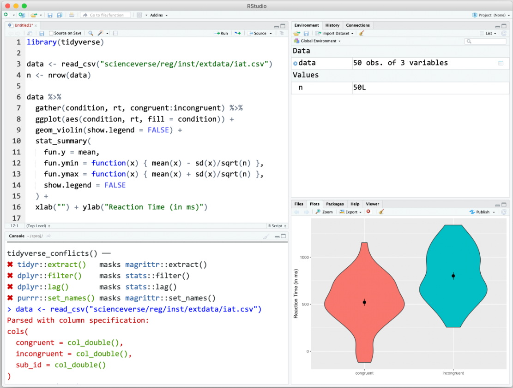
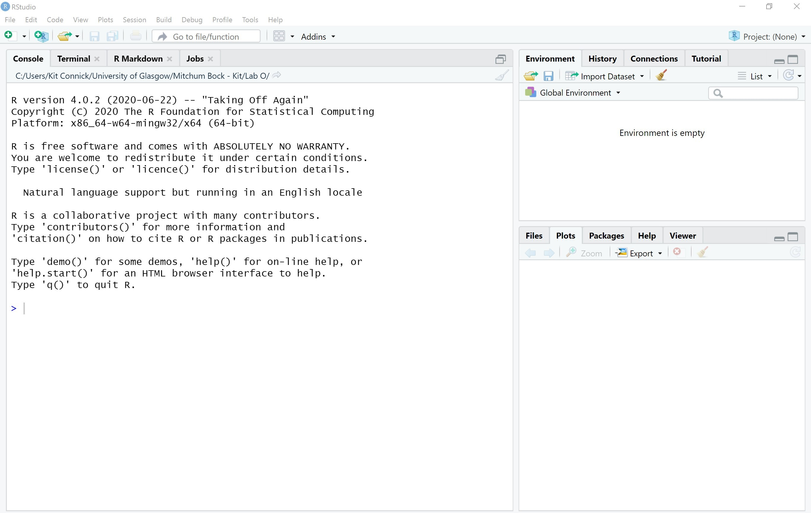
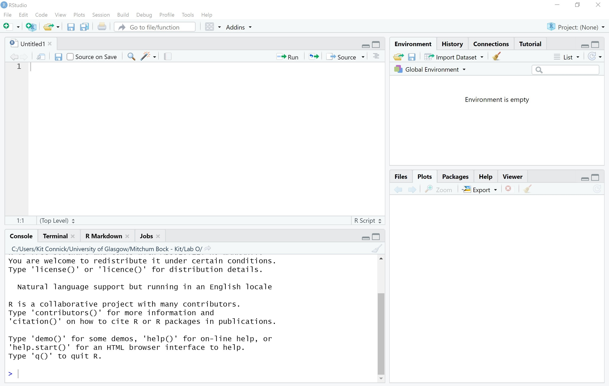

# Part 1: Intro to R and RStudio {width=10%} {width=10%}

```{r setup, include = FALSE}
knitr::opts_chunk$set(echo = TRUE)
if (!requireNamespace("webexercises")) {
  stop("You must have the 'webexercises' package installed to knit to HTML.\n   install.packages(\"webexercises\")")
} else {
  library("webexercises")
}

library(tidyverse)
```

```{r echo = FALSE}
set.seed(12042016)
```


<!-- ```{r img-rrstudio, echo=FALSE, out.width = "10%", fig.cap="The R and RStudio logos"} -->
<!--  -->
<!-- knitr::include_graphics("images/RStudio.jpg") -->
<!-- ``` -->

## Intended Learning Outcomes {#ilo-intro}

* Be introduced to R and RStudio
* Be able to load add-on packages
* Be able to get help for packages and functions
* Be able to create objects by writing and running R code


## R and RStudio {#intro-r-rstudio}

R is a programming language that you will write code in and RStudio is an Integrated Development Environment (IDE) which makes working in R easier. Think of it as knowing English and using a plain text editor like NotePad to write a book versus using a word processor like Microsoft Word. You could do it, but it would be much harder without things like spell-checking and formatting and you wouldn't be able to use some of the advanced features that Word has developed. In a similar way, you can use R without RStudio but we wouldn't recommend it. RStudio serves as a text editor, file manager, spreadsheet viewer, and more. The key thing to remember is that although you will do all of your work using RStudio for this course, you are actually using two pieces of software which means that from time-to-time, both of them may have separate updates.

<div id="hello" class="greeting message" style="color: grey;">
### OPTIONAL: Installing R and RStudio on your device {#intro-installing-r}

You **DO NOT** need to intall R or RStudio on your own laptop or desktop computer.  You are expected to complete these labs on the universities PCs, and these already have R and RStudio installed.  However, R and (basic) RStudio are free to download and install, so there is a document on the Moodle page with some technical details on installing R and RStudio on your computer. If you already have R and/or RStudio installed, we recommend updating to the latest version before you work through this course. 

### OPTIONAL: Accessing **R**/**RStudio** virtually

There is also the option of accessing RStudio running on the University servers via the Windows Virtual Desktop (WVD).

[GLASGOW ANYWHERE DESKTOP](https://www.gla.ac.uk/myglasgow/anywhere/desktop/) has a link to [this page](https://rdweb.wvd.microsoft.com/arm/webclient/index.html) where you can log in via the College of Science and Engineering’s **CoSE Desktop** link (**DON'T** use the Mathematics and Statistics link).  This will log you in to a remote desktop which appears on your screen as if you were in a physical computer lab on campus.  

To run **RStudio**, all you need to do is search for **RStudio** in the search box in the bottom left of the screen and click on the **RStudio** icon and it will open.  If Rstudio displays "an update is available" message on startup, click **ignore update**.

To download the data for the labs from the S1Y Moodle page, open an internet browser (e.g. Chrome) from within the WVD, login to Moodle via the University website and download the .csv file from the S1Y Moodle page.   

We suggest you save the .csv data files and store your R script files in the same folder on the "OneDrive - University of Glasgow" area since you'll also have access to this area from outside the WVD. 
</div>

## RStudio Quickstart Guide {#rstudio_ide}

The R software gives the computer the ability to process the R programming language. We will never use that software directly. Instead, we will use [RStudio](http://www.rstudio.com){target="_blank"}, an integrated development environment (IDE) which runs R for us via a graphical user interface (GUI) .  

To open RStudio from the University PCs:

- Open the “Maths-Stats” folder on the desktop.
- Open the “R Studio” programme from this folder.

To create a text file (called an "R script") to write your R code in select from the menu:

- `> File > New File > R Script`

To save the R script file, go to

- `> File > Save`

A dialogue box will appear asking where (on which drive) you would like to save the code.

Save this R script file by navigating to a drive letter (e.g. H: or M:) or to a USB stick that you've brought with you and save it with a relevant filename, e.g. "S1Y_Lab_1". **IMPORTANT: DO NOT navigate to ANY folders like "Documents" or "Desktop".**

Once saved in a `.R` script file, you can use your code again, so theres's no need to type it in a second time. If you close RStudio and then open it again you can read in your code by going to

- `> File > Open File…`

and find the code file from the location where you saved it.

The RStudio IDE is arranged with four window.

```{r img-rstudio, echo=FALSE, fig.cap="The RStudio IDE"}
#
#

```

By default, the upper left pane is the **source pane**, where you view, write, and edit code from files and view data tables in a spreadsheet format. When you first open RStudio, this pane won't display until we open a script file (like we did above) or load in some data.  We 'run' (i.e. execute) code in the script file by selecting the row(s) we want to run and then clicking the  `Run` icon OR by holding down the `ctrl` key and `Enter` key at the same time.  The results of executing the code (if any) appear in the lower left pane.

The lower left pane is the **console pane**, where you can type in commands and view output messages. You can write code in the console to test it out. The code will run and can create objects in the environment, but the code itself won't be saved. You need to write your code into a script in the source pane to save it.

The right panes have several different tabs that show you information about your code. The most used tabs in the upper right pane are the **Environment** tab and the **Help** tab. The environment tab lists some information about the object that you have defined in your code. We'll learn more about the Help tab in Section\ \@ref(function-help).

In the lower right pane, the most used tabs are the **Files** tab for directory structure, the **Plots** tab for plots made in a script, the **Packages** tab for managing add-on packages, and the **Viewer** tab to display reports created by your scripts. 

<!-- You can change the location of panes and what tabs are shown under **`Preferences > Pane Layout`**. -->

<!-- ### Reproducibility {#intro-reproducibility} -->

<!-- In this class, you will be learning how to make reproducible reports. This involves writing scripts that transform data, create summaries and visualisations, and embed them in a report in a way that always gives you the same results. -->

<!-- When you do things reproducibly, others (and future you) can understand and check your work. You can also reuse your work more easily. For example, if you need to create a report every month with the social media analytics for your company, a reproducible report allows you to download a new month's data and create the report within seconds. It might take a little longer to set up the report in the first instance with reproducible methods, but the time it saves you in the long run is invaluable. -->

<!-- ::: {.try data-latex=""} -->
<!-- Appendix\ \@ref(rstudio-settings) shows you how to change two important settings in the global Options to increase reproducibility. Your settings should have: -->

<!-- * Restore .RData into workspace at startup: `r mcq(c("Checked", answer = "Not Checked"))` -->
<!-- * Save workspace to .RData on exit: `r mcq(c("Always", answer = "Never", "Ask"))` -->
<!-- ::: -->

<!-- ### Themes and accessiblilty -->

<!-- You can customise how RStudio looks to make it work for you. Click `Tools` - `Global Options` - `Appearance`. You can change the default font, font size, and general appearance of RStudio, including using dark mode. Play around with the settings and see what you prefer - you're going to spend a lot of time with R, it might as well look nice! -->


<!-- ## Sessions {#intro-sessions} -->

<!-- If you have the above settings configured correctly, when you open up RStudio and start writing code, loading packages, and creating objects, you will be doing so in a new session and your Environment tab should be completely empty. If you find that your code isn't working and you can't figure out why, it might be worth restarting your R session. This will clear the environment and detach all loaded packages - think of it like restarting your phone. There are several ways that you can restart R: -->

<!-- * Menu: Session > Restart R -->
<!-- * <span class=\"apple\">Cmd-Shift-F10</span> or <span class=\"windows\">Ctl-Shift-F10</span> -->
<!-- * type `.rs.restartR()` in the console -->

<!-- Try doing each of these now. Additionally, now would be a good time to create a notebook where you can keep a record of useful hints and tips and things to try when your code isn't working. Add "restart R session" to this notebook as your first item.  -->


## Skip ahead to Section 3 "Part 2 - Analyzing Data"

The next section (2 "Getting started using RStudio") is for reference for you to look at in your own time.  In the lab, please go straight to Section 3 "Part 2 - Analyzing Data" and continue working from there.

## Credit where credit is due

This introductory lab incorporates and adapts materials from:

Nordmann, E. & DeBruine, L. (2022) Applied Data Skills. v1.0. Retrieved from https://psyteachr.github.io/ads-v1/ doi: 10.5281/zenodo.6365077 and

Hill, A. (2022) Data Visualization in the Tidyverse: The Great Tidy Plot Off. Retrieved from https://alison.netlify.app/uo-tidy-bakeoff
